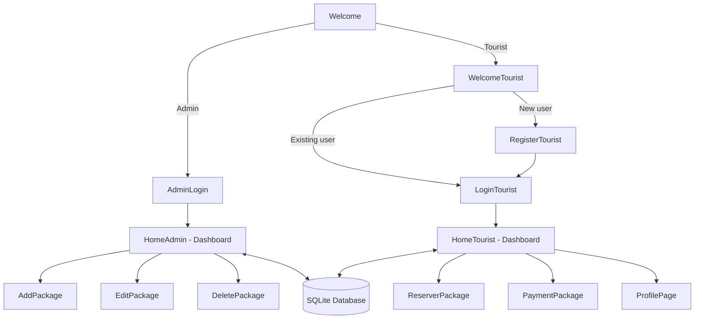

# 🧳 TravelFlex — Tourist Package Booking Desktop Application

A desktop application built with **C++ and Qt** for managing and booking tourist travel packages, featuring separate workflows for administrators and tourists, backed by a local **SQLite** database.

---

## 📌 Description

TravelFlex was built to solve a common small-agency problem: managing travel packages, tourist registrations, and bookings without relying on spreadsheets or paper records.

The application provides two distinct experiences from a single entry point:

- **Admins** can manage the catalog of travel packages (create, edit, delete) and get a dashboard overview of tourists, packages, bookings, and recent activity.
- **Tourists** can register an account, browse available packages, make reservations, track payment status of their bookings, and view/manage their personal profile.

All data (tourists, admins, packages, bookings) is persisted locally in a SQLite database, and the UI is built entirely with Qt Widgets — no web browser or server required.

---

## ✨ Features

**General**
- Landing screen letting the user choose between the Admin space and the Tourist space.

**Admin side**
- Secure-looking login screen for administrators (username/password check against the database).
- Dashboard ("Tableau de Bord") with statistics cards: number of tourists, number of packages, number of bookings.
- Recent bookings table on the dashboard.
- Add a new travel package (name, destination, description, price, duration).
- Edit an existing package (search by name, update fields).
- Delete a package from a live table view (`QSqlTableModel` + `QTableView`) that refreshes automatically.
- Logout back to the welcome screen.

**Tourist side**
- Tourist registration with personal details (first/last name, username, email, phone, passport number, nationality, date of birth, password), including checks for existing username/email.
- Tourist login.
- Personalized dashboard with a welcome message and quick stats (number of bookings, etc.) and a recent activity table.
- Browse all available travel packages with destination, description, price and duration.
- Reserve a package (with duplicate-reservation check).
- View and pay for pending/unpaid reservations.
- Personal profile page showing the tourist's registered information.
- Logout back to the welcome screen.

---

## 🛠️ Technologies Used

| Category            | Technology                                      |
|---------------------|--------------------------------------------------|
| Language             | C++17                                            |
| UI Framework         | Qt 6 (Qt Widgets module)                         |
| Database             | SQLite (via `QtSql` / `QSqlDatabase`)            |
| Build System         | CMake (`CMakeLists.txt`, `qt_add_executable`)    |
| IDE / Toolchain used | Qt Creator, MinGW 64-bit                         |
| Resources            | Qt Resource System (`.qrc`) for icons/images     |

---

## 🏗️ Architecture / How It Works

The application follows a simple **widget-per-screen** architecture typical of Qt desktop apps: each screen is its own `QWidget` subclass, and navigation happens by showing/hiding widgets or opening new windows. A single `Database` class centralizes all SQL access and is passed by pointer to every screen that needs data.

- `Database` (`database.h/.cpp`) wraps `QSqlDatabase`/`QSqlQuery` and exposes high-level methods (`checkAdminCredentials`, `registerTourist`, `addBooking`, `getAllPackages`, etc.) — no other class talks to SQL directly.
- `MainWindow` initializes the database connection at startup.
- `Welcome` is the entry screen, branching to either the Admin flow or the Tourist flow.
- **Admin flow:** `AdminLogin` → `HomeAdmin` (dashboard) → `AddPackage` / `EditPackage` / `DeletePackage`.
- **Tourist flow:** `WelcomeTourist` → `RegisterTourist` / `LoginTourist` → `HomeTourist` (dashboard) → `ReserverPackage` (booking) / `PaymentPackage` (unpaid reservations) / `ProfilePage`.



Database schema (as defined in `datab.db`):

| Table   | Key columns                                                                 |
|---------|------------------------------------------------------------------------------|
| Admin   | id, username, password                                                       |
| Tourist | id, Firstname, Lastname, username, email, phone, passportNumber, nationality, dateOfBirth, password |
| Package | id, name, destination, description, price, duration                         |
| Booking | id, touristId, packageId, bookingDate, status, paymentStatus                 |

---

## 📁 Project Structure

The project is organized by responsibility rather than as one flat folder:

```
TravelFlex/
├── CMakeLists.txt            # Build configuration
├── README.md
│
├── src/
│   ├── main.cpp               # Application entry point
│   │
│   ├── core/                  # Data layer
│   │   └── database.h/.cpp    # Central class for all SQL operations
│   │
│   ├── common/                # Shared / entry screens
│   │   ├── mainwindow.h/.cpp/.ui
│   │   └── welcome.h/.cpp     # Landing screen (Admin vs Tourist)
│   │
│   ├── admin/                 # Admin-facing screens
│   │   ├── adminlogin.h/.cpp
│   │   ├── homeadmin.h/.cpp      # Dashboard (stats, sidebar navigation)
│   │   ├── addpackage.h/.cpp     # Create a package
│   │   ├── editpackage.h/.cpp    # Search & update a package
│   │   └── deletepackage.h/.cpp  # Delete a package
│   │
│   └── tourist/               # Tourist-facing screens
│       ├── welcometourist.h/.cpp # Login vs Register choice
│       ├── registertourist.h/.cpp
│       ├── logintourist.h/.cpp
│       ├── hometourist.h/.cpp    # Dashboard (stats, sidebar navigation)
│       ├── reserverpackage.h/.cpp # Browse & reserve packages
│       ├── paymentpackage.h/.cpp  # View & pay unpaid reservations
│       └── profilepage.h/.cpp     # Personal information page
│
├── resources/
│   ├── resources.qrc          # Qt resource file
│   └── images/2.png           # App logo
│
└── database/
    └── datab.db                # SQLite database file
```

> Every file still uses simple `#include "xxx.h"` statements (no path prefixes). `CMakeLists.txt` exposes `src/core`, `src/common`, `src/admin` and `src/tourist` as include directories, so nothing needed to change inside the `.h`/`.cpp` files themselves.

---

## ⚙️ Installation

### Prerequisites
- **Qt 6** (Widgets + Sql modules) — developed and tested with Qt 6.9.0
- **CMake** ≥ 3.16
- A C++17-compatible compiler (project was built with MinGW 64-bit on Windows; should also work with MSVC/GCC/Clang)
- **Qt Creator** (recommended, for the simplest build experience) or CMake + a compatible generator (Ninja, Makefiles, etc.)

### Clone the repository
```bash
git clone https://github.com/<your-username>/<your-repo>.git
cd <your-repo>/login
```

### Build with CMake
```bash
cmake -S . -B build -DCMAKE_PREFIX_PATH="<path-to-your-Qt-installation>"
cmake --build build
```

> Replace `<path-to-your-Qt-installation>` with your local Qt install path (e.g. `C:/Qt/6.9.0/mingw_64` on Windows).

Alternatively, open `CMakeLists.txt` directly in **Qt Creator** and build from there.

---

## 🔧 Configuration

The database path used to be hardcoded to a personal machine path. It has been made portable: `CMakeLists.txt` copies `database/datab.db` next to the built executable automatically, and `main.cpp` opens it with:

```cpp
Database* db = new Database(QCoreApplication::applicationDirPath() + "/datab.db");
```

No manual path editing or `.env` file is required — this happens automatically on every build.

---

## ▶️ Execution

1. Build the project — `datab.db` is copied next to the executable automatically (see [Configuration](#-configuration)).
2. Run the compiled executable:

```bash
# From the build directory
./login          # Linux/macOS
login.exe        # Windows
```

Or simply press **Run** inside Qt Creator once the CMake project is configured.

---

## 🚀 Usage

1. On launch, the **Welcome** screen lets you choose between **Admin** and **Tourist**.
2. **As an admin:** log in with admin credentials stored in the `Admin` table, then use the sidebar to view dashboard statistics, or add/edit/delete travel packages.
3. **As a tourist:**
   - New users register via the **Register** form (personal info + passport/nationality + password).
   - Returning users log in via the **Login** form.
   - Once logged in, browse the dashboard, reserve a package from the catalog, pay for pending reservations, and view your profile information.

---